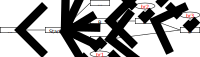

= Git-Br
:xrefstyle: short

In this graded exercice, we’ll simulate that we go back in time (to correct some problem in a previous version of a software), create two branches (to try two different approaches), and then merge those two branches.

* Accept https://classroom.github.com/a/LQ4a_O4e[this assignment]. This will create a repository initialized with some history. Clone this newly created repository, work on it locally, then push your additions to the remote.
* We’ll start with an existing commit that we will name `Start`. That is the commit representing the state of the application on `Saturday, May 18, 2019, 15:00:00 +0200`, that is, the commit just before that time.
** For example, if there is a commit `C1` on that day at 14:30 and a commit `C2` just following it on that day at 15:20, then `Start = C1`.
* You must create four commits and three branches in total. The history should look like <<Goal>> when you are done. Make sure your pointers are exactly as pictured, including the branches.
** The three dots represent the rest of the history of that repository (you do not deal with this part).
** Commits `A`, `B`, `C`, `D` are your own commits.
** Commit `A` adds a file named `hello.txt` containing “first try”; its parent is `Start`.
** Commit `B` adds a file named `hello.txt` containing “second try”; its parent is `Start`.
** Commit `C` adds a file named `supplements.txt` containing “Hello, world”; its parent is `B`.
** `D` is the result of merging `A` and `C` (after resolving the conflict). It keeps both the text “first try” AND the text “second try” (on the next line), thus, commit `D` contains a blob `hello.txt` that contains two lines (in addition to the blob `supplements.txt` that has no change from `C`).
* When you are done, check (for example, using the GitHub web interface) that your commits and branches have reached the remote repository.

[[Goal]]
.Desired history at end of the exercice (italicized: your additions to the history)

