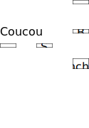

= Git-Br

In this graded exercice, we’ll simulate that we go back in time (to correct some problem in a previous version of a software), create two branches (to try two different approaches), and then merge those two branches.

* Accept this assignment. This will create a repository initialized with some history.
* We’ll start with an existing commit that we will name `S`. That is the commit representing the state of the application on `Saturday, May 18, 2019, 15:00:00 +0200`, that is, the commit just before that time.
** For example, if there is a commit `C1` on that day at 14:30 and a commit `C2` just following it on that day at 15:20, then `S = C1`.
* You must create four commits and three branches in total.  Two of your commits must have `S` as parent, one of your commit must have another of your own commits as parent, and the last commit must have two of your own commits as parents, as indicated below. The history should look like <<C1>> when you are done. Make sure your pointers are exactly as pictured, including the branches.
** The three dots represent the rest of the history of that repository (you do not deal with this part).
** Commits `A`, `B`, `C`, `D` are your own commits.
** `D` is the result of merging `A` and `C` (after resolving the conflict).
** Commit `A` adds a file named `hello.txt` containing “first try”.
** Commit `B` adds a file named `hello.txt` containing “second try”.
** Commit `C` adds a file named `supplements.txt` containing “Hello, world”.
** Commit `D` keeps both the text “first try” AND “second try” on the next line, thus, commit `D` contains a file `hello.txt` that contains two lines (in addition to the `supplements.txt` file that has no change from `C`).

[[C1]]
.Desired history at end of the exercice (italicized: your additions to the history)

// 20361320acd7c4738b2a77a8fdb38b133efcfb30

