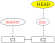
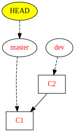

= Git: step by step exercices
:toc: preamble
:sectanchors:
:xrefstyle: short

Some step by step exercices for git starters. 

== Local repository

=== First commit
* Create a new directory `project` and put there a file `start.txt` with content `hello`.
* Initialize a new git repository in your directory.
** Hint: check in the slides, or in the Cheat sheets, how to do this.
* Put `start.txt` in the index. Modify its content so that it contains `hello2`. Observe (using a git command) the difference between the version of this file in the workdir, in the index, and in the repository (all three should be different). Now place your new version of `start.txt` in the index.
* Send your first commit. (Where is it sent?) Check that your current situation conforms to <<C1>>.
** Hint: try both commands `git log` and `git log --graph --oneline --decorate --all`, understand how they differ.
** Also: install https://git-cola.github.io/[Git Cola] and use the command `git-cola dag` to view your history graphically.

[[C1]]
.Right after the first commit

=== First branch
You have got a bold idea to solve some problem in your project. But you’re not so sure it will work. You want to create a branch and modify things there in the meantime.

* Create a branch `dev`. Commit in this branch a file `bold.txt` containing `try 1`. Thus, your new commit contains two files (`bold.txt` and `start.txt`). Check that your current situation conforms to <<C2>>.

[[C2]]
.A commit and another commit in a branch

=== Second branch
Now that this (huge) work is done, you want to try an alternative approach. You’re also not sure, so you’ll do it in a different branch.

* Starting back from `master`, create a branch `dev2`. Commit in this branch a file `bold.txt` containing `alternative approach` and a file named `supplement.txt` containing `hello suppl`. Check that your current situation conforms to <<C3>>.

[[C3]]
.Two branches plus master

=== Merge
Thinking about it, you decide to merge both your ideas into `master`.

* Go back to branch `master` and merge `dev` into it. Before doing it, try to predict the resulting situation, and whether it will produce a fast-forward.
* Now let’s merge `dev2` into `master` (now containing the changes from `dev`). First predict what situation will result. Try it and obtain a final result with everything merged into the `master` branch.

(Solutions diagrams are here: https://github.com/oliviercailloux/java-course/blob/main/Git/Merged1.svg[Merged1], https://github.com/oliviercailloux/java-course/blob/main/Git/Merged2.svg[Merged2]. Don’t cheat! Solve the exercice before looking.)

== Remote repository

* Clone your local repository into another directory of your same computer, in order to create another repository. Let’s call your original repository R1, your new one (cloned) R2, and the respective work directories WD1 and WD2. This way we simulate multiple users, using only your computer.
** Hint: proceed as if cloning from an url, but give it instead your local path to your repository.
* Now R2 should have remote repository named `origin` pointing to R1, and a remote-tracking branch `master`. (The term “remote” is ill-suited here, generally your remote would effectively be located on another computer.) Use git commands to see what `origin` refers to, as well as `master` and `origin/master`.
* Change the content of the file `bold.txt` into WD1 (add your first name). Commit into R1.
* Fetch the new informations from R1 into R2. Check that the last commit from R1 exists in the history of R2. Observe the difference between `git log` and `git log --all`.
* Predict what `master` and `origin/master` refer to in R2, and check. What is in the file `bold.txt` in R2? Why?
* Merge into R2 your last changes from R1.

== Remote repository on GitHub

* Create a new remote remository, RG, on https://github.com/[GitHub]. Connect R1 to RG.
** Hint: understand and adapt the instructions given by GitHub.
* Send your local informations to RG. Check with a browser that they have reached GitHub.
* Clone RG into a new directory, R3. Modify a file and commit into R3. Send it to RG. Check online.
* Modify something in R1, commit. Try to send it to RG. Why is it refused? How can you effectively send your last modification online? Send it to your RG repository.
* Send your two branches `dev` and `dev2` to RG as well. Check that you see them online.

