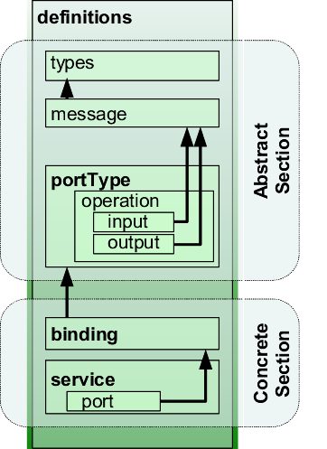

= WSDL in brief
:toc: preamble
:sectanchors:
//works around awesome_bot bug that used to be published at github.com/dkhamsing/awesome_bot/issues/182.
:emptyattribute:

This document gives a _rough_ and _incomplete_ overview of WSDL 1.1. (WSDL 2.0 being not much supported at the moment.)

NOTE: The reader supposedly has basic knowledge of link:HTTP.adoc[HTTP], XML and link:SOAP.adoc[SOAP].

NOTE: The parts marked BP are complements to the spec given by WS-I BP (all versions from 1.0 to 2.0) (see <<refs>>).

////
TODO Find out how to escape bracket in [Public domain]; C++.
Link image to https://commons.wikimedia.org/wiki/File:WSDL_11vs20.png
Return value?
soapAction may be left undefined?
portType ⇐ binding ⇐ port ⇐ soap:address
////

== Overview
The Web Services Description Language (WSDL) spec defines a WSDL document. A WSDL document is an XML document that describes a web service, abstractly and concretely.

Except when mentioned otherwise, the elements this document refers to are XML elements with WSDL namespace [small]#(`\http://schemas.xmlsoap.org/wsdl/`)#.

.WSDL 1.1
, via Wikimedia Commons", float="left"]

* An abstract description indicates the operations that the web service provides, and the types it uses.
** The types it uses are defined under `types` and `message` elements.
** The operations are grouped together in `portType` elements. Though obscurely named, a `portType` simply represents a set of operations that coherently fit together (think about interfaces in Java, or abstract classes in C++).
** A WSDL file may define several such `portType` elements.
* A concrete description indicates how those abstract operations must be invoked, by linking them to an underlying exchange protocol, using a _link-type_.
** This is done using two elements: `binding`, that makes operations concrete (and specify how to encode types, …), and `service`, that defines concrete endpoints. (Those two elements may appear several times in a document.)
** A `service` contains a list of `port` elements. A `port`, or “endpoint”, indicates where the web service is to be reached.
** The elements used inside the `binding` and `service` elements depend on the underlying exchange protocol adopted by the web service being described, thus, depend on the chosen link-type.
* WSDL defines three link-types to make abstract descriptions concrete: SOAP, HTTP GET/POST and MIME. [small]#(It also defines an extension mechanism permitting to define more such link-types.)# This document only describes the SOAP link-type.

See https://www.w3.org/TR/2001/NOTE-wsdl-20010315#_wsdl[Example 1] (W3C).

== Internal references
Many WSDL elements admit an optional `name` attribute. XML Elements which admit a name may be referred to using a Qualified Name (QName). For example, the element `<portType name="StockQuotePortType">` defined in a namespace recognized under the prefix `tns` can be referred to by the QName `tns:StockQuotePortType` (see https://www.w3.org/TR/2001/NOTE-wsdl-20010315#_soap-e[Example 3]).

== Types and messages
XML schema are typically used to define types. The types to be used can be defined under `types`, using the `xsd:schema` element (thus XSD import mechanisms may be used in the usual manner). [small]#(WSDL also allows for other type systems.)#

The types are used to define messages, using `message` elements.

* A message consists of `part` elements.
* Each `part` has a name, and indicates either an `element` QName or a `type` QName (that must be defined in a schema under the `types` element, see above).
* How the parts are used depends on the link-type (see below). Typically, each part is a parameter of some operation or used as return value.

== Operations
An operation has a name, (usually) an input message, possibly an output message, and possibly fault messages. When output and fault messages are defined, it is to be understood that either the output or a fault will be returned, not both. Each of the `input`, `output` and `fault` elements designate the corresponding message using a QName.

== SOAP link-type
The SOAP link-type is used to complement an abstract web service description (consisting in `types`, `message` and `portType` elements) in order to make it a description of a SOAP web service. The SOAP binding used is the HTTP one (see link:SOAP.adoc#HTTP_binding[SOAP in brief]). [small]#(WSDL tolerates other SOAP bindings as well.)# Such a link is done using one `binding` element per `portType` to be defined as a component of the SOAP web service, and one `service` element.

The `binding` element is used to specify how abstract messages sent to or from an abstract interface (defined as a `portType`) are to be serialized as SOAP messages.

* The `binding` indicates, as its `type`, the QName of the `portType` it relates to (for example, `<binding type="tns:StockQuotePortType">`).
* The `binding` indicates that the link-type is SOAP by including as a sub-element the element `soap:binding`, where the `soap` prefix corresponds to the WSDL namespace for WSDL SOAP link-type [small]#(\http://schemas.xmlsoap.org/wsdl/soap12/)#.
* The `soap:binding` sub-element has a `transport` attribute, whose value is typically `\http://schemas.xmlsoap.org/soap/http`, to indicate that the HTTP binding is chosen as a SOAP binding.
* The `soap:binding` sub-element has a `style` attribute, whose value may be `document` (default) or `rpc`. [small]#(The `style` may also be set per-operation instead of for a whole `portType`.)#
* The `binding` element has one `operation` sub-element per operation that is to be reachable by SOAP. That sub-element specifies linking information for the _abstract_ operation with the same name within the related `portType`. Each such `operation` element has a `<soap:operation soapAction="uri"/>` sub-element that specifies the SOAP action to use to target that operation. Each `operation` also has sub-elements for each of the input, output and faults defined in the corresponding abstract operation, with for each of those a sub-element `soap:body` that, for `rpc` style, specifies a namespace (BP). Unbound parts are discouraged and should be ignored (BP http://ws-i.org/Profiles/BasicProfile-2.0-2010-11-09.html#R2209[R2209]{emptyattribute}).

Here is how to interpret these informations (BP).

With `document` style, there can be at most one message part in a message [small]#(unless `soap:body` `part` attribute is used)#. That part must be defined using the `element` attribute. It appears directly under the SOAP Body element.

With `rpc` style, each part is a parameter or a return value. Parts must be defined using the `type` attribute. The SOAP Body element will contain an operation wrapper element containing, for each part, a part wrapper element followed by the content of the part: `<opName><part1>…</part1><part2>…</part2></opName>`. The operation wrapper element namespace is the value of the namespace attribute of the `soap:body` element and its local name is either the name of the operation, for a SOAP Request, or the name of the operation suffixed with “Response”. The `name` and `type` attributes of `part` elements define the local name and type of the corresponding part wrapper. Part wrappers have no namespace.

Document style is http://ws-i.org/Profiles/BasicProfile-2.0-2010-11-09.html#Consistency_of_style_Attribute[encouraged].

BP mandates unique operation signatures, so that an endpoint may identify which operation is invoked based on the input message. The operation signature is the fully qualified name of the child element of the SOAP body [small]#(assuming no wsa:Action SOAP header blocks are used)#.

The `service` element consists in a set of `port` elements. Each `port` refers to a given `binding` element using a QName.
A sub-element of `port` gives the SOAP HTTP address to use to call the SOAP web service: `soap:address location="uri"`.

[[refs]]
== Refs
* W3C https://www.w3.org/TR/2001/NOTE-wsdl-20010315[WSDL 1.1] note; https://www.w3.org/Submission/2006/SUBM-wsdl11soap12-20060405/[WSDL 1.1 to SOAP 1.2] link-type
* WSDL https://www.w3.org/TR/?title=wsdl[Specifications] on W3C
* Web Services Interoperability (http://www.ws-i.org/[WS-I]) Basic Profile (BP) clarifies and modifies WSDL and related specifications to promote interoperability.
//* BP 2.0 corrected http://ws-i.org/profiles/basic/1.1/wsdl-2004-08-24.xsd[WSDL schema] TODO check 2.0 or 1.1?

== Supplementary details
What this document calls a link-type, namely the type of relation between the abstract and the concrete web service descriptions, is usually referred to as a _binding_. This presents risks of confusion with the WSDL `binding` element. Here the word “binding” is only used to refer to the element.

The WSDL element `import` can be used to import WSDL documents into other WSDL documents. (The spec also allows to use the WSDL `import` element to import XSD schemas, but this is now discouraged, see http://www.ws-i.org/Profiles/BasicProfile-1.0-2004-04-16.html#refinement16498504[BP 1.0] and later versions. The XSD import mechanism should be preferred.)

In WSDL 2.0, `portType` is called `interface`, `port` is called `endpoint`.

Each of the operation message (input, …) in a SOAP link-type has a `soap:body` whose `use` must (http://ws-i.org/Profiles/BasicProfile-2.0-2010-11-09.html#R2706[BP 2.0], 1.1) be `literal` (or left to the default, `literal`, BP 1.2). (`encoded` is not used any more, see this https://docs.microsoft.com/en-us/previous-versions/dotnet/articles/ms995710(v=msdn.10)[opinion]).

BP 2.0 does not require the sender to set soapAction in the HTTP header nor as part of the Content-Type header. Thus, it may not be relied upon.

An operation can be classified as: One-way (input only); Request-response (with input, output, and possibly fault messages); or other two types (that this document is not concerned with).

